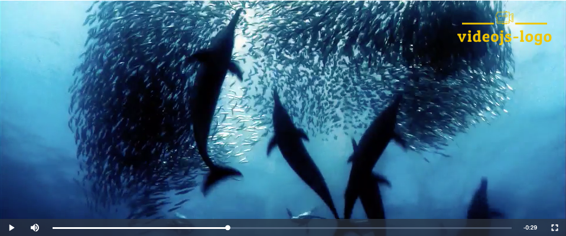

# videojs-logo

A plugin to display a logo image on the player.



## Table of Contents

<!-- START doctoc generated TOC please keep comment here to allow auto update -->
<!-- DON'T EDIT THIS SECTION, INSTEAD RE-RUN doctoc TO UPDATE -->


- [Installation](#installation)
- [Usage](#usage)
  - [`<script>` Tag](#script-tag)
  - [Browserify/CommonJS](#browserifycommonjs)
  - [Browserify/ES6](#browserifyes6)
  - [RequireJS/AMD](#requirejsamd)
- [Configuration](#configuration)
- [Methods](#methods)
- [License](#license)

<!-- END doctoc generated TOC please keep comment here to allow auto update -->
## Installation

```sh
npm install --save videojs-logo
```

## Usage

To include videojs-logo on your website or web application, use any of the following methods.

### `<script>` Tag

This is the simplest case. Get the script in whatever way you prefer and include the plugin _after_ you include [video.js][videojs], so that the `videojs` global is available.

```html
<script src="//path/to/video.min.js"></script>
<script src="//path/to/videojs-logo.min.js"></script>
<script>
  var player = videojs('my-video');

  player.logo({
    image: 'my_logo.png'
  });
</script>
```

### Browserify/CommonJS

When using with Browserify, install videojs-logo via npm and `require` the plugin as you would any other module.

```js
var videojs = require('video.js');

// The actual plugin function is exported by this module, but it is also
// attached to the `Player.prototype`; so, there is no need to assign it
// to a variable.
require('videojs-logo');

var player = videojs('my-video');

player.logo({
  image: 'my_logo.png'
});
```

### Browserify/ES6

When using with Browserify, install videojs-logo via npm and `import` the plugin as you would any other module.

```js
import videojs from 'video.js';

// The actual plugin function is exported by this module, but it is also
// attached to the `Player.prototype`; so, there is no need to assign it
// to a variable.
import 'videojs-logo';

const player = videojs('my-video');

player.logo({
  image: 'my_logo.png'
});
```

### RequireJS/AMD

When using with RequireJS (or another AMD library), get the script in whatever way you prefer and `require` the plugin as you normally would:

```js
require(['video.js', 'videojs-logo'], function(videojs) {
  var player = videojs('my-video');

  player.logo({
    image: 'my_logo.png'
  });
});
```

## Configuration

| Property    | Attributes   | Type       | Default value | Description                                                                                          |
| ----------- | ------------ | ---------- | ------------- | ---------------------------------------------------------------------------------------------------- |
| **image**   | **Required** | **String** |               | **The URL to the logo image.**                                                                       |
| url         | Optional     | String     |               | A url to be linked to from the logo. If the user clicks the logo the link will open in a new window. |
| position    | Optional     | String     | "top-right"   | The location to place the logo (top-left, top-right, bottom-left, or bottom-right).                  |
| offsetH     | Optional     | Number     | 0             | Horizontal offset (px) from the edge of the video.                                                   |
| offsetV     | Optional     | Number     | 0             | Vertical offset (px) from the edge of the video.                                                     |
| width       | Optional     | Number     |               | The width of the logo image (px). If not specified, it will be the width of the original image.      |
| height      | Optional     | Number     |               | The height of the logo image (px). If not specified, it will be the height of the original image.    |
| padding     | Optional     | Number     | 5             | Padding around the logo image (px).                                                                  |
| fadeDelay   | Optional     | Number     | 5000          | Time until fade-out begins (msec). If `null` is specified, automatic fade-out is not performed.      |
| hideOnReady | Optional     | Boolean    | false         | Do not show the logo image when the player is ready.                                                 |

## Methods

You can also manually show / hide the logo image at any time.

```js
// To show the logo image on the player's play event:
player.on('play', () => {
  this.player.logo().show();
});
```

| Method | Description         |
| ------ | ------------------- |
| show() | Show the logo image |
| hide() | Hide the logo image |

## License

MIT. Copyright (c) tapioca24


[videojs]: http://videojs.com/
